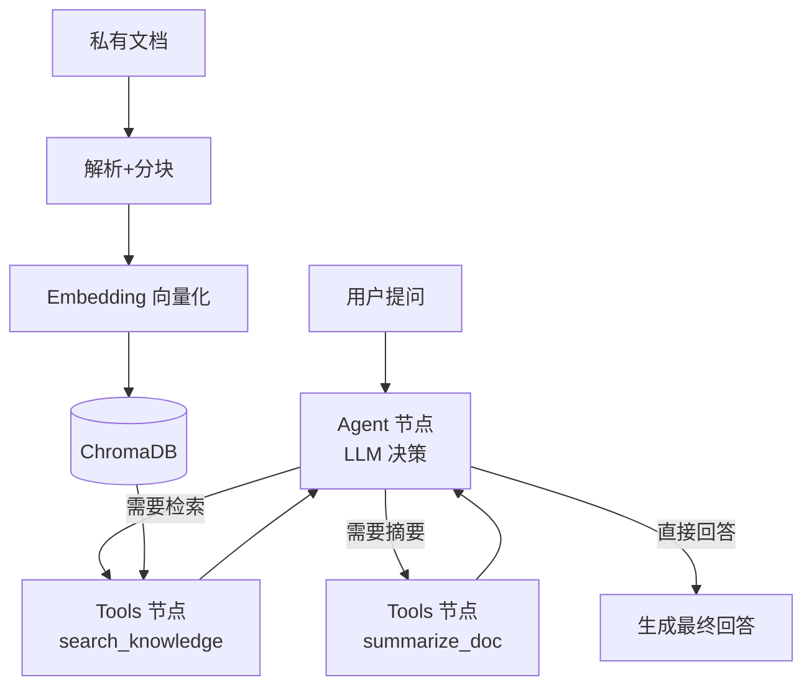

# 文档知识库 RAG Agent

面向文档场景的检索增强生成（RAG）+ 工具调用 Agent。上传私有文档（Markdown / TXT / PDF），即可基于文档内容进行问答；Agent 可自主决定调用知识检索、文档摘要等工具，并内置 LLM-as-Judge 自动化评测流水线。

对标飞书文档 Agent / 知识库场景：读取文档 → 切片向量化 → 检索 → 工具调用 → 生成回答 → 自动评测。

## 技术栈


| 模块        | 技术                                 | 说明                           |
| --------- | ---------------------------------- | ---------------------------- |
| Agent 编排  | LangGraph                          | StateGraph 构建 ReAct 多轮工具调用流程 |
| 大模型       | GLM-4-Flash（免费）/ 可切换任意 OpenAI 兼容模型 | 通过环境变量切换                     |
| Embedding | 智谱 embedding-3 / 硅基流动 bge          | API 形式，本地无需 GPU              |
| 向量库       | ChromaDB                           | 本地持久化，开箱即用                   |
| 文档解析      | pypdf / 内置文本读取                     | 支持 md /txt/pdf               |
| 评测        | LLM-as-Judge                       | 相关性 / 忠实度 / 有用性三维打分          |

## 架构




## 快速开始

### 1. 准备 API Key（二选一，均有免费额度）


* **智谱开放平台**（推荐，默认配置）：注册 [https://open.bigmodel.cn](https://open.bigmodel.cn) ，创建 API Key。`glm-4-flash` 完全免费，`embedding-3` 有免费额度。

* **硅基流动**：注册 [https://siliconflow.cn](https://siliconflow.cn) ，创建 API Key，模型填 `Qwen/Qwen2.5-7B-Instruct`，Embedding 填 `BAAI/bge-large-zh-v1.5`。

### 2. 安装依赖


```
cd doc-agent

pip install -r requirements.txt
```

### 3. 配置环境变量


```
copy .env.example .env

\# 编辑 .env，填入 LLM\_API\_KEY；若用硅基流动则同时修改 LLM\_BASE\_URL / LLM\_MODEL / EMBED\_MODEL
```

### 4. 导入文档到知识库


```
python ingest.py
```

把需要问答的文档放入 `data/` 目录（md /txt/pdf 均可），再运行此命令完成分块、向量化入库。

### 5. 启动问答


```
python main.py
```


```
\> 什么是RAG？

RAG（检索增强生成）是一种将外部知识库与大语言模型结合的技术架构……
```

### 6. 自动化评测


```
python evaluate.py tests/eval\_questions.json
```

自动批量问答并生成 `report.json` 评测报告（相关性 / 忠实度 / 有用性平均分）。

## 目录结构


```
doc-agent/

├── config.py          # 配置（API、分块参数、路径）

├── tools.py           # 分块 / 向量化 / Chroma 检索

├── agent.py           # LangGraph ReAct Agent（工具调用）

├── ingest.py          # 文档入库入口

├── main.py            # 命令行问答入口

├── evaluate.py        # LLM-as-Judge 自动化评测

├── data/sample.md     # 示例文档（可直接测试）

├── tests/eval\_questions.json  # 评测问题集

└── .env.example       # 环境变量模板
```

## 简历项目描述（直接使用）

> **文档知识库 AI Agent | Python, LangGraph, ChromaDB, GLM, LLM-as-Judge**
> 搭建面向文档场景的 RAG + Agent 系统，实现文档解析、文本分块、向量化检索，支持基于私有文档问答，模拟云文档知识库能力。
> 基于 LangGraph 实现 Agent 多轮思考与工具调用，自定义知识检索、文档摘要工具，Agent 自主决策调用链路后生成回答。
> 构建 LLM-as-Judge 自动化评测流水线，从相关性、忠实度、有用性三维评估回答质量，迭代优化提示词与检索策略。
> 开源至 GitHub，编写完整文档与部署教程。

## 面试高频问题（做完项目要吃透）


1. RAG 完整链路是什么？分块大小怎么选？选错了会有什么问题？

2. LangGraph 状态图原理？Agent 什么时候触发工具调用？

3. 幻觉产生原因？你在项目里怎么优化？

4. LLM-as-Judge 为什么可行？有什么局限？

5. 如果上生产，面对海量文档和高并发，你会考虑哪些后端挑战？

## 常见问题


* **知识库为空**：先运行 `python ingest.py` 导入文档。

* **模型报错**：检查 `.env` 中 API Key / Base URL / 模型名是否与所选平台一致。

* **评测分数低**：属正常现象，用于迭代优化。可调整提示词、增大 TOP\_K、优化分块参数。