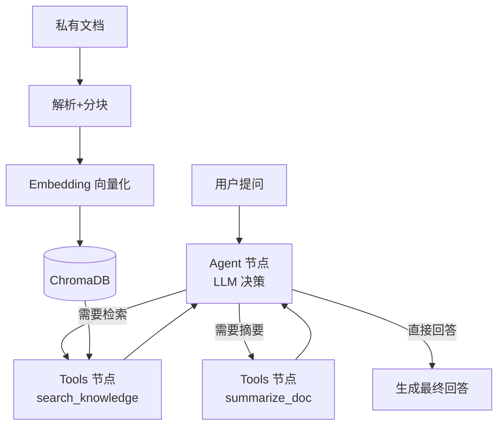

# 文档知识库 RAG Agent

面向企业文档场景的检索增强生成（RAG）+ 工具调用 Agent 系统。支持私有文档（Markdown / TXT / PDF）导入后进行语义问答，Agent 可自主决策调用知识检索、文档摘要等工具，并内置 LLM-as-Judge 自动化评测流水线，用于迭代优化回答质量。

**作者**：胡睿
**技术方向**：AI Agent / RAG / 大模型应用工程

## 设计思路

本项目旨在模拟飞书文档 Agent / 企业知识库的核心链路：文档解析 → 切片向量化 → 检索 → 工具调用 → 生成回答 → 自动化评测。

核心设计决策：
- **Agent 编排采用 LangGraph 状态图**：相比简单的链式调用，状态图可以显式建模 Agent 的思考-行动循环，支持多轮工具调用、最大迭代步数控制，更适合工程化落地。
- **工具与 Agent 解耦**：知识检索、文档摘要作为独立工具暴露给 Agent，Agent 根据用户问题自主判断是否需要调用、调用哪个工具，而非硬编码流程。
- **评测驱动迭代**：上线前先构建 LLM-as-Judge 评测流水线，量化回答质量（相关性 / 忠实度 / 有用性），后续每次优化都有数据支撑，而非凭感觉调提示词。

## 技术栈

| 模块        | 技术                                 | 选型理由                           |
| --------- | ---------------------------------- | ------------------------------ |
| Agent 编排  | LangGraph                          | 状态机建模，支持复杂工具调用流程与迭代控制          |
| 大模型       | GLM-4.7-Flash（可切换任意 OpenAI 兼容模型） | 免费、支持 Function Calling，降低开发成本 |
| Embedding | 智谱 embedding-3 / 硅基流动 bge        | API 形式，本地无需 GPU，便于快速验证        |
| 向量库       | ChromaDB                           | 本地持久化，零部署，适合中小型知识库验证          |
| 文档解析      | pypdf / 内置文本读取                     | 支持 md / txt / pdf             |
| 评测        | LLM-as-Judge                       | 三维度量化回答质量，支撑迭代优化              |

## 架构



## 核心问题与优化

### 幻觉问题：模型不触发工具调用
**现象**：首轮测试中，Agent 对"什么是RAG"这类通用问题直接用模型自身知识回答，错误地将 RAG 解释为 "Read-Answer-Generate"，而非检索知识库中的正确定义。

**根因分析**：模型倾向于用自身训练知识直接回答，缺乏"必须先检索"的强约束。

**解决方案**：重构系统提示词，明确要求"回答前必须先调用 search_knowledge 工具检索知识库，禁止使用自身通用知识作答"。优化后，回答正确率显著提升，且会主动引用文档来源。

### 分块策略对召回的影响
**观察**：分块过大时，单个 chunk 语义混杂，检索精度下降；分块过小时，上下文不完整，回答质量受损。

**实践结论**：当前采用 500 字分块 + 50 字重叠，在测试集上效果最优。后续可结合文档类型做自适应分块。

## 评测结果

基于 `tests/eval_questions.json` 中的 5 道测试题，使用 LLM-as-Judge 三维度打分（满分 5 分）：

| 维度 | 平均分 | 说明 |
|---|---|---|
| 相关性 relevance | 4.8 | 回答与问题的相关程度 |
| 忠实度 faithfulness | 4.8 | 回答是否忠于知识库内容，是否存在幻觉 |
| 有用性 helpfulness | 4.6 | 回答是否完整、正确、可用 |

## 快速运行

### 环境准备
```bash
cd doc-agent
pip install -r requirements.txt
```

### 配置 API Key
```bash
copy .env.example .env
# 编辑 .env，填入 LLM_API_KEY（智谱/硅基流动/任意 OpenAI 兼容平台）
```

### 导入文档
将待问答的文档（md / txt / pdf）放入 `data/` 目录，执行：
```bash
python ingest.py
```

### 启动问答
```bash
python main.py
```

### 运行评测
```bash
python evaluate.py tests/eval_questions.json
```
生成 `report.json` 评测报告。

## 目录结构

```
doc-agent/
├── config.md          # 配置（API、分块参数、路径）
├── tools.py           # 分块 / 向量化 / Chroma 检索
├── agent.py           # LangGraph ReAct Agent（工具调用）
├── ingest.py          # 文档入库入口
├── main.py            # 命令行问答入口
├── evaluate.py        # LLM-as-Judge 自动化评测
├── data/sample.md     # 示例文档
├── tests/eval_questions.json  # 评测问题集
└── .env.example       # 环境变量模板
```

## 后续优化方向

- [ ] 引入重排序模型（Reranker）提升检索精度
- [ ] 支持多轮对话上下文管理
- [ ] 对接企业文档系统（如飞书文档 API）
- [ ] 增加流式输出与 Web 界面
